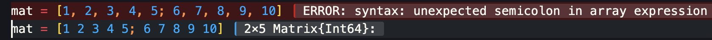

These are basically the stuff I learnt while playing around with the language.

***starting a repl***

_____________________

cmd+shift+p - julia start repl


use "]" to play around with packages in julia and backspace to return to normal state. 
use "?" to go to help.

***Importing libraries in your files***

we use the *using* keyword to import libraries in Julia. to run a line, we need ot press cmd+enter keys. It runs the program line by line.


***packages***
_____________________

Basic commands are ```add <package-name>, rm <package-name>, status``` to know packages present. To add specific versions of packages, add ```@<version-number>``` after package name.


upadting is just up or update <package-name>
gc for garbage collection and gc --all to force delete stuff.


***variables***

Variables are similar to any other language, typeof() func to check type of a variable.

In Julia, '' is for character literal and "" is for strings.

Best part of Julia is it allows for Unicode characters using LaTeX, so we can use LaTeX to use whichever character we want.

In Julia you can just use \pi and \euler to get values of pi and e.


***methodswith***

Function signature  methodswith(typ[, module or function]; supertypes::Bool=false])
It returns all the possible methods that require argument of given type.

***comparision expressions***

AND - &&

OR - ||

NOT - !

If we use simple & then that would be bitwise AND.

We can even use LaTeX symbols for less than or equal to and other expressions.

```isa``` is one of the thigns we can use to check truth of the expression.


***running part of the code***

If you just want to run a part of the code, just select part you want to run and you will get result of just that.


***Vectors, Matrices***
 
Vector type in Julia is ```Vector{typ}```

So a vector ```x=[1,2,3,4,5]``` is ```Vector{Int64}```

For matrix we define it as ```y = [1 2 3;4 5 6]```, we separate elements using space and not comma as Julia assumes comma separated one as an array and will throw an error. Similar to Vector, y matrix would be of type ```Matrix{Int64}```



If we have multiple types of elements in our array then it will be of type ```{any}```

***operations on vector***
If we want to append an element into a vector we use push command.

```push!(vec, <val>)```

In Julia if a Vector is of type ```Vector{Int64}``` and we try to push a Float, it will convert value to an integer whereas in python it will append the float itself and it we try to push a string it will give an error.


***if elseif else***

```
if <statement>
    <code>
elseif <statement>
    <code>
else
    <code>
end
```

***for loop***

```
for i in vec
    println(i)
end
```

```
for i in 1:2:10 # to access elements in steps of 2
    println(i)
end
```

***while***

```
while <cond>
    body
end
```

***functions***

```
function func_name(<parameters>)
    code
end
```

short form of the same

```
function_name<parameters> = code
```

Julia does not care about indentation.

we separate positional arguments and keyword arguments using semi colon

```
function sum_two(x,y)
    return x+y
end

function sum_two_with_keywords_args(x,y;key1=1,key2=10)
    return sum_two([x,y,key1,key2])
end
```

***anonymous function***

same as lambda function, we can define a lambda function in Julia too.

```
(x->x*7)(8)
or
filter(x->x<9, 1:10)
``` 

***struct***

Structs are pretty simple to define, structs are default immutable, to make it immutable, need to define it as ```mutable struct``` and to define a type for the struct add ```::typ```. If we do not give a type, it will take type as ```any```.

```
mutable struct point
    x_coord::Float64
    y_coord::Float64
end
```


Once definition we cannot to change the struct definition i.e in that specific repl, if we have really have to change it, we need to restart the REPL, or other solution is definie a struct within a module.

There is another workaround using **Revise.jl**, add the package **Revise** and define the struct within a module, say ```MyModule```, then you can redefine the struct and run it again without getting any errors.

```
module MyModule
struct <make whatever changes you need>
end
```


***Scraping***

Scraping in Julia can be done using HTTP, Gumbo and Cascadia

Using HTTP, we extract the html data from the url

```
using HTTP
url = "url of website you want to scrape"
r = HTTP.get(url)
```

Then we use gumbo to parse the html and we use index to separate head and body of the html file, we need only the body as that has the data we want to scrape.

```
using Gumbo
h = parsehtml(String(r.body))
body = h.root[2]
```

In the real world websites, code is pretty cluttered and it is not very ideal to just use Gumbo for scraping, we use Cascadia to find specific css elements to get the data we need. In our case "wikitable sortable plainrowheaders" holds the table we need.

```
using Cascadia
eachmatch(Selector("table"), body)
s = eachmatch(Selector("name of class we want to extract"), body)
```

Then starts the part where we have to play around with the tables to get the extract pattern to extract the code, from the page source we can see that ```[1][2]``` is the table for test centuries, we can confirm that by testing it out too. So we define the table as ```table = s[1][2]```.

Now we have to extract the pattern for the text part of the html, which will again vary column by column, because some of the columns have text hyperlinked, others will have just text, some will have text and \n, some will have images as well as text.


There is a possibility the pattern changes within a single column too, so have to take all that into consideration and use try catch blocks.


Finally after scraping all the columns, assemble the matrix and add it to csv files.


